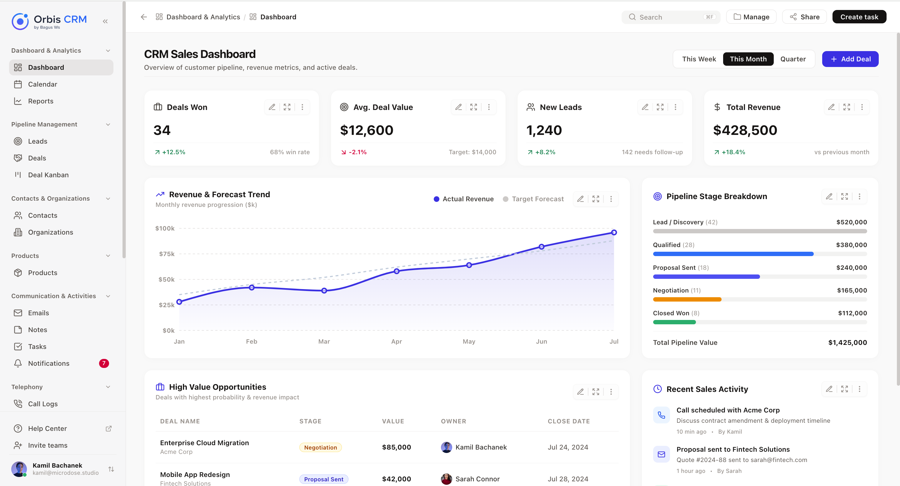

# Orbis CRM - Frontend



Modern CRM (Customer Relationship Management) application.
This repository contains the **Frontend** client for Orbis CRM, built with React, Vite, and Tailwind CSS.

## Getting Started

1. **Install dependencies:**
   ```bash
   npm install
   ```

2. **Start the development server:**
   ```bash
   npm run dev
   ```

3. **Build for production:**
   ```bash
   npm run build
   ```

## Technologies Used

- **React 18 & Vite**: Fast development and building.
- **Tailwind CSS**: Utility-first CSS framework for rapid UI development.
- **React Router DOM**: Client-side routing.
- **Framer Motion & Goey Toast**: For premium, smooth morphing animated toasts.
- **Lucide React**: Beautiful and consistent iconography.

## Notifications (Goey Toast)

This project uses [goey-toast](https://github.com/goey-toast) for all notifications to provide a premium user experience.

**Example Usage:**
```jsx
import { useToast } from '../context/ToastContext';

// Inside your component
const toast = useToast();

toast.success('Data saved successfully!');
toast.error('Failed to connect to the server.');
```

## License
MIT
